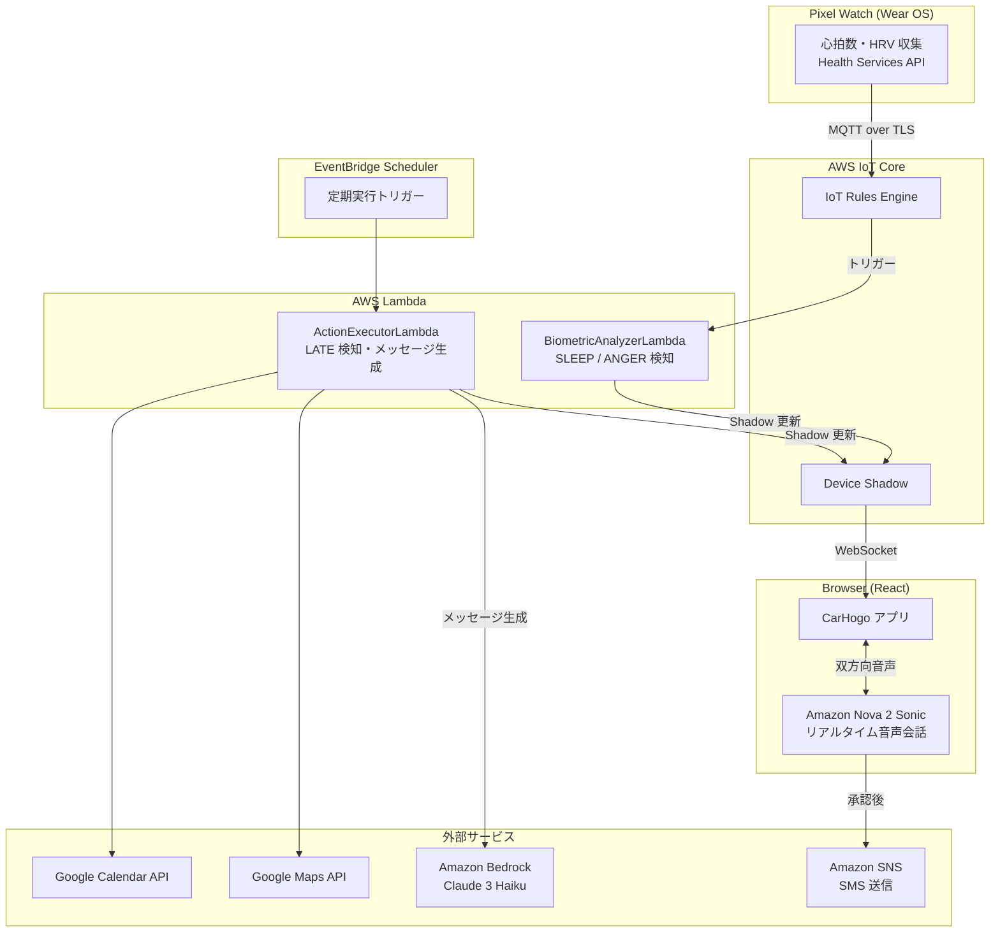

# CarHogo

ドライバーの「自制心」を完全に奪い去る、過保護なAI安全コパイロット

## 💡 プロジェクト概要

居眠り・怒り・遅刻ストレスという運転中の3大リスクを、生体信号からリアルタイムで検知し、ドライバーが自覚する前にシステムが介入・解消します。

- **課題**: 既存の安全技術は「警告」で終わる。警告に気づき、自制するのはドライバー自身の負担
- **解決策**: Pixel Watchの心拍データ × Amazon Nova 2 Sonicのリアルタイム音声会話で、危険な状態を自動検知・自動介入・自動処理する
- **こだわり**: ドライバーはハンドルを握るだけでいい。眠気に抗う努力も、怒りを我慢する精神力も、遅刻の連絡も——すべてCarHogoが代行する「過保護さ」

## 🚧 開発ステータス

> **現在はInceptionフェーズ（設計完了・実装開始前）です。**
> 要件定義・ユーザーストーリー・アーキテクチャ設計・ユニット分解が完了し、これからコード実装を開始します。

| フェーズ | ステータス |
|---------|----------|
| Inception（要件・設計） | ✅ 完了 |
| Construction Unit 1: CDK インフラ | 🔜 次のステップ |
| Construction Unit 2: Pixel Watch | ⏳ 未着手 |
| Construction Unit 3: backend Lambda | ⏳ 未着手 |
| Construction Unit 4: Browser React アプリ | ⏳ 未着手 |

## 🎯 3つの「過保護」アクション

### 😴 SLEEP アクション — 居眠り自動介入

心拍数がベースラインから低下し、ステアリング操作の消失を検知すると、Amazon Nova 2 Sonicが自動で話しかけてドライバーを覚醒させます。心拍数が回復するまで会話を継続。

> 「長距離お疲れ様です。今日の夕ご飯、何にするか決めてますか？」

### 😤 ANGER アクション — 怒り自動沈静化

心拍数が急激にスパイクした場合（煽り運転など）、共感的なAI音声会話が自動介入。感情が高まった瞬間に穏やかな対話で遮断します。

> 「今のはイライラしますよね。気持ちはよく分かります。あなたの余裕が事故を防ぎました。」

### 🕐 LATE アクション — 遅刻連絡の完全自動化

Google CalendarとMaps APIでETAを継続計算。遅刻を検知すると、Amazon Bedrockが謝罪メッセージを生成し、Nova 2 Sonicがドライバーに読み上げて確認。承認するとAmazon SNS経由でSMSが自動送信されます。ドライバーはスマートフォンに触れません。

## 🛠 使用技術

- **Pixel Watch**: Kotlin 1.9 / Wear OS API 33 / Health Services API（心拍数・HRV収集）
- **IoT パイプライン**: AWS IoT Core（MQTT over TLS）/ Device Shadow / IoT Rules Engine
- **AI 音声会話**: Amazon Nova 2 Sonic（リアルタイム双方向音声）
- **メッセージ生成**: Amazon Bedrock — Claude 3 Haiku（遅刻メッセージ自動生成）
- **Backend**: AWS Lambda × 2 / Node.js 20.x / TypeScript 5.x
- **Database**: Amazon DynamoDB（シングルテーブル設計）
- **Browser**: React 18 / Vite / TypeScript 5.x
- **Infrastructure**: AWS CDK v2 / TypeScript（全AWSリソースをコードで定義）
- **認証**: Amazon Cognito（User Pool + Identity Pool）
- **通知**: Amazon SNS（SMS送信）
- **外部API**: Google Maps Directions API / Google Calendar API

### システム構成図



## 📁 リポジトリ構成（予定）

```
carhogo/                          # モノレポ
├── cdk/                          # Unit 1: AWS CDK インフラ定義
├── backend/                      # Unit 3: バックエンド Lambda
│   ├── biometric-analyzer/       # BiometricAnalyzerLambda（生体情報解析）
│   ├── action-executor/          # ActionExecutorLambda（LATE アクション処理）
│   └── shared/                   # 共有モジュール
├── watch/                        # Unit 2: Pixel Watch Wear OS アプリ
├── browser/                      # Unit 4: ブラウザ React アプリ
└── aidlc-docs/                   # 設計ドキュメント（AI-DLC）
```

> アプリケーションコードは実装フェーズで追加されます。

## 🚀 使い方（実装完了後に更新予定）

実装完了後に以下を追記します。

1. リポジトリをクローン
2. CDK デプロイ（AWS リソースのプロビジョニング）
3. Pixel Watch アプリのビルド・インストール
4. ブラウザアプリのビルド・デプロイ

## 📋 主要ユーザーストーリー

| ID | タイトル |
|----|---------|
| US-01 | Pixel Watch でモニタリングを開始する |
| US-02 | Pixel Watch でモニタリングを停止する |
| US-03 | ブラウザでリアルタイム生体情報を確認する |
| US-05 | 居眠り検知により音声会話が自動的に始まる |
| US-06 | 音声会話によって覚醒状態を維持する |
| US-08 | 怒り検知により音声会話が自動的に始まる |
| US-11 | 遅刻が自動検知され謝罪メッセージが生成される |
| US-13 | ドライバーの音声承認でSMSが自動送信される |

全14ストーリーは [aidlc-docs/inception/user-stories/stories.md](aidlc-docs/inception/user-stories/stories.md) を参照。

## 🎯 成功指標（MVP）

| 指標 | 目標値 |
|------|--------|
| SLEEP/ANGER検知 → Nova 2 Sonic会話開始 | 5秒以内 |
| 生体トリガー → ブラウザUI更新 | 2秒以内 |
| LATE検知 → SMS送信完了 | 10秒以内 |
| システム稼働率 | 99.9%以上 |

## 📄 設計ドキュメント

| ドキュメント | 内容 |
|------------|------|
| [要件定義](aidlc-docs/inception/requirements/requirements.md) | 機能要件・非機能要件 |
| [ユーザーストーリー](aidlc-docs/inception/user-stories/stories.md) | 14ストーリー・受け入れ基準（Gherkin形式） |
| [アーキテクチャ設計](aidlc-docs/inception/application-design/application-design.md) | システム構成・設計決定 |
| [コンポーネント定義](aidlc-docs/inception/application-design/components.md) | 全コンポーネント・メソッドシグネチャ |
| [ユニット構成](aidlc-docs/inception/application-design/unit-of-work.md) | 4ユニット・開発フェーズ |

## 📜 ライセンス

MIT License
