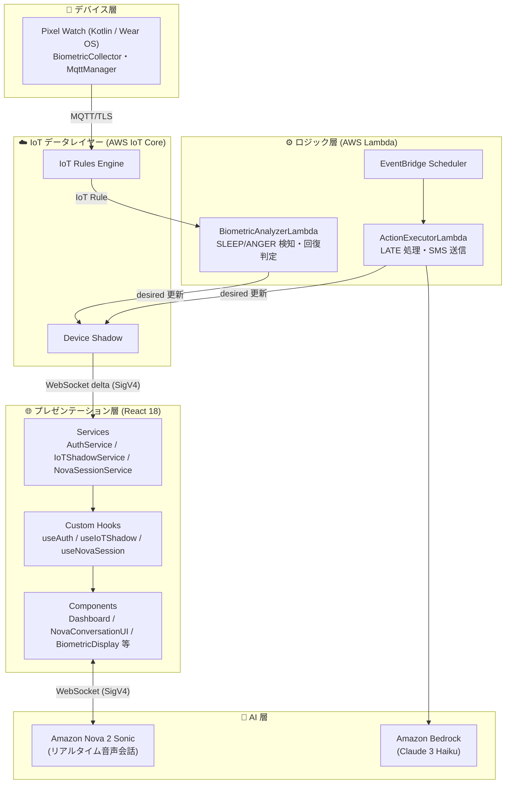

# アプリケーション設計 統合サマリー — CarHogo

## アーキテクチャ概要

レイヤード・アーキテクチャ視点でのシステム全体構成（データフロー視点の構成図は [README.md](../../../README.md#システム構成図) を参照）:

---

## 設計決定と根拠

| 設計項目 | 決定 | 根拠 |
|---------|------|------|
| Lambda 構成 | 統合2関数（BiometricAnalyzer + ActionExecutor） | IoT トリガー系とスケジューラー系を分離。各関数の責務が明確。 |
| CDK スタック | シングルスタック | MVP スコープでは1スタックで十分。変更が1箇所に集約されデプロイが簡単。 |
| Pixel Watch Activity | 単一 MainActivity | MVPスコープ（開始/終了ボタン + ステータス表示）には1画面で十分。 |
| React サービス層 | Singleton サービス + Hooks | AWS SDK 操作をサービスクラスに集約することで、Hooks をシンプルに保ち、テスト容易性を確保。 |
| Nova 2 Sonic セッション | アクション毎に新規接続 | 実装がシンプル。常時接続より接続管理の複雑さが低い。アクション間のセッション状態の混乱を防ぐ。 |

---

## コンポーネント総数

| レイヤー | コンポーネント数 |
|---------|---------------|
| Lambda バックエンド | 2 関数 × 複数内部モジュール |
| 共有モジュール（backend/shared/） | 4 モジュール（ShadowPublisher・ActionLogRepository・types・logger） |
| CDK インフラ | 1 スタック |
| Pixel Watch Wear OS | 7 クラス（AppState・WatchConfigLoader・CertificateLoader・BiometricCollector・MqttManager・MonitoringService・MainActivity） |
| ブラウザ React | 3 サービス + 3 Hooks + 7 コンポーネント = 13 |

---

## 詳細アーティファクト参照

| ドキュメント | 内容 |
|-----------|------|
| [components.md](components.md) | 全コンポーネントの定義と責務 |
| [component-methods.md](component-methods.md) | 全メソッドシグネチャ（型定義含む） |
| [services.md](services.md) | SLEEP/ANGER/LATE アクション別フロー図 |
| [component-dependency.md](component-dependency.md) | 依存関係マトリクス・通信パターン・Shadow スキーマ・DynamoDB 設計 |
