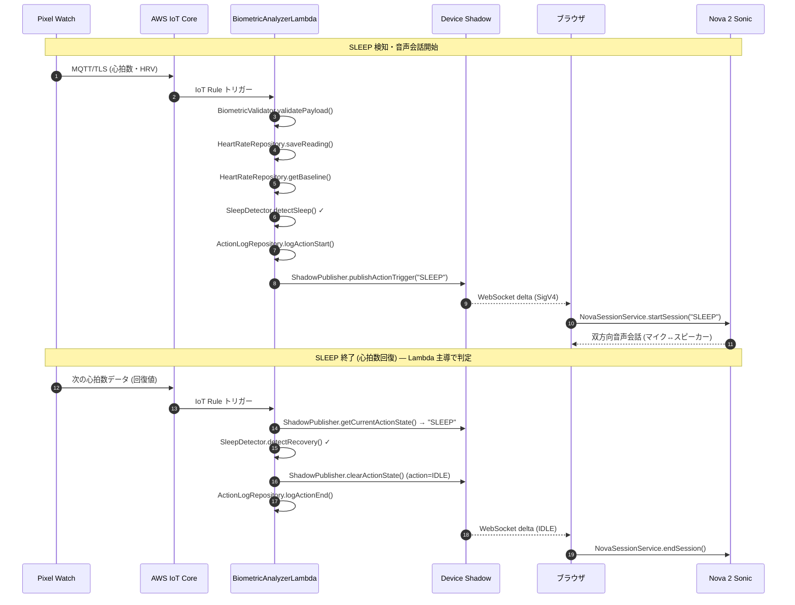
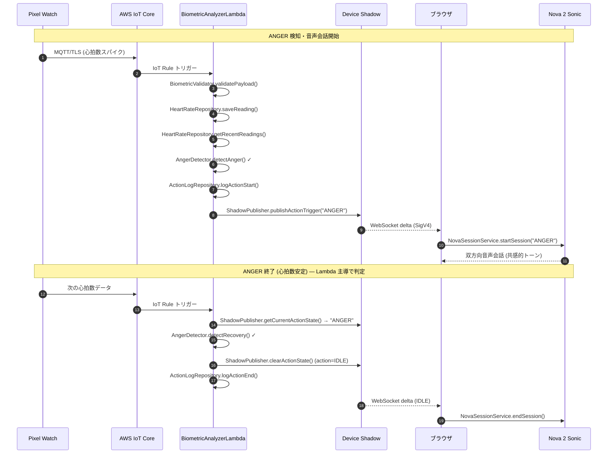
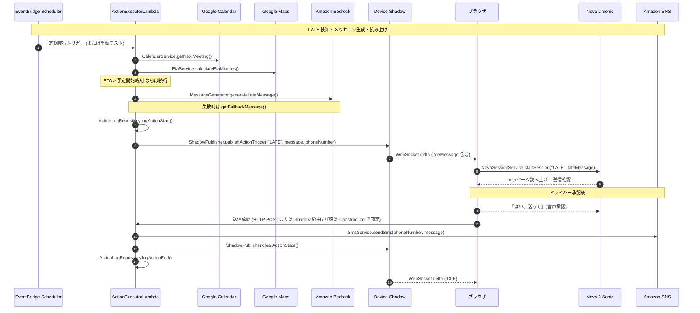

# サービス定義・フロー図 — CarHogo

## アーキテクチャ概要

CarHogoは**イベント駆動型サーバーレスアーキテクチャ**を採用します。
基本フロー: `Pixel Watch → IoT Core → Lambda → Device Shadow → ブラウザアプリ`

---

## SLEEPアクション フロー



**回復判定の責務**: 会話継続中も Pixel Watch は通常通り心拍数データを送信し続け、各データを **BiometricAnalyzerLambda が受信時に Shadow から現在のアクション状態を取得**して判定する。SLEEP/ANGER 状態であれば `detectRecovery()` を呼び出し、回復が確認できれば Shadow を `IDLE` に戻す。ブラウザは Shadow delta を受信して自動的にセッションを終了する。

---

## ANGERアクション フロー



---

## LATEアクション フロー



---

## 共有サービスモジュール（Lambda 間）

以下のモジュールは BiometricAnalyzerLambda と ActionExecutorLambda の両方が使用します。
`backend/shared/` ディレクトリに配置し、各 Lambda が import します。

| モジュール | 配置 |
|----------|------|
| `ShadowPublisher` | `backend/shared/shadowPublisher.ts` |
| `ActionLogRepository` | `backend/shared/actionLogRepository.ts` |
| `types.ts`（共通型定義） | `backend/shared/types.ts` |
| `logger.ts`（構造化ログ） | `backend/shared/logger.ts` |

---

## ブラウザ サービス層

```
React コンポーネント
  └─ Custom Hooks（useAuth / useIoTShadow / useNovaSession）
       └─ Singleton Services（AuthService / IoTShadowService / NovaSessionService）
            └─ AWS SDK v3（Cognito / IoT / Bedrock）
```

**サービス初期化フロー（アプリ起動時）:**
```
1. AuthService.signIn() → Cognito 認証
2. AuthService.getAwsCredentials() → Identity Pool で Credentials 取得
3. IoTShadowService.connect() → IoT Core WebSocket 接続確立
4. IoTShadowService.subscribeToShadow() → Shadow delta 購読開始
（NovaSessionService はアクション毎に startSession() / endSession()）
```

---

**関連ドキュメント**:
- [コンポーネント定義](./components.md) — 全コンポーネントの責務・属性一覧
- [コンポーネントメソッド](./component-methods.md) — 全メソッドシグネチャ・型定義
- [コンポーネント依存関係](./component-dependency.md) — 依存関係マトリクス・通信パターン・Shadow スキーマ
- [アプリケーション設計 統合サマリー](./application-design.md) — システム全体のアーキテクチャ概要
