# 実行プラン — CarHogo

## 詳細分析サマリー

### 変更インパクト評価

| 影響領域 | 評価 | 説明 |
|---------|------|------|
| ユーザー向け変更 | Yes | ドライバーが直接使用する Wear OS アプリ・ブラウザアプリ・音声会話 UI |
| 構造的変更 | Yes | 新規システム構築（IoT→Lambda→Browser のイベント駆動アーキテクチャ） |
| データモデル変更 | Yes | DynamoDB スキーマ（UserConfig・ActionLog・HeartRateHistory）の新規設計 |
| API 変更 | Yes | MQTT トピック設計・Device Shadow スキーマ・Lambda インターフェース |
| NFR インパクト | Yes | リアルタイムレイテンシ（5秒以内）・Nova 2 Sonic WebSocket・MQTT サブ秒 |

### リスク評価

| 項目 | 評価 |
|------|------|
| **リスクレベル** | **High** |
| ロールバック複雑度 | Moderate（CDK destroy で全リソース削除可能） |
| テスト複雑度 | Complex（Pixel Watch 実機・Nova 2 Sonic 実接続が必要） |

**高リスク要因:**
- Amazon Nova 2 Sonic は初使用（ブラウザ直接接続アーキテクチャの実証が最重要課題）
- Amazon Bedrock（Claude 3 Haiku）が申請済み・承認待ち → フォールバック実装が必須
- Google Maps / Calendar API が未準備 → スタブ差し替え可能設計が必要
- 5秒以内のレイテンシ要件（Nova 2 Sonic セッション開始遅延が未知数）

---

## ワークフロー可視化

```mermaid
flowchart TD
    Start(["ユーザーリクエスト"])

    subgraph INCEPTION["🔵 INCEPTION PHASE"]
        WD["Workspace Detection\nCOMPLETED"]
        RE["Reverse Engineering\nSKIPPED"]
        RA["Requirements Analysis\nCOMPLETED"]
        US["User Stories\nCOMPLETED"]
        WP["Workflow Planning\nCOMPLETED"]
        AD["Application Design\nCOMPLETED"]
        UG["Units Generation\nCOMPLETED"]
    end

    subgraph CONSTRUCTION["🟢 CONSTRUCTION PHASE"]
        FD["Functional Design\nEXECUTE per unit"]
        NFRA["NFR Requirements\nEXECUTE per unit"]
        NFRD["NFR Design\nEXECUTE per unit"]
        ID["Infrastructure Design\nEXECUTE per unit"]
        CG["Code Generation\nEXECUTE per unit"]
        BT["Build and Test\nEXECUTE"]
    end

    subgraph OPERATIONS["🟡 OPERATIONS PHASE"]
        OPS["Operations\nPLACEHOLDER"]
    end

    Start --> WD
    WD --> RE
    RE --> RA
    RA --> US
    US --> WP
    WP --> AD
    AD --> UG
    UG --> FD
    FD --> NFRA
    NFRA --> NFRD
    NFRD --> ID
    ID --> CG
    CG -.->|次のユニット| FD
    CG --> BT
    BT -.-> OPS
    BT --> End(["完了"])

    style WD fill:#4CAF50,stroke:#1B5E20,stroke-width:3px,color:#fff
    style RE fill:#BDBDBD,stroke:#424242,stroke-width:2px,stroke-dasharray:5 5,color:#000
    style RA fill:#4CAF50,stroke:#1B5E20,stroke-width:3px,color:#fff
    style US fill:#4CAF50,stroke:#1B5E20,stroke-width:3px,color:#fff
    style WP fill:#4CAF50,stroke:#1B5E20,stroke-width:3px,color:#fff
    style AD fill:#4CAF50,stroke:#1B5E20,stroke-width:3px,color:#fff
    style UG fill:#4CAF50,stroke:#1B5E20,stroke-width:3px,color:#fff
    style FD fill:#FFA726,stroke:#E65100,stroke-width:3px,stroke-dasharray:5 5,color:#000
    style NFRA fill:#FFA726,stroke:#E65100,stroke-width:3px,stroke-dasharray:5 5,color:#000
    style NFRD fill:#FFA726,stroke:#E65100,stroke-width:3px,stroke-dasharray:5 5,color:#000
    style ID fill:#FFA726,stroke:#E65100,stroke-width:3px,stroke-dasharray:5 5,color:#000
    style CG fill:#4CAF50,stroke:#1B5E20,stroke-width:3px,color:#fff
    style BT fill:#4CAF50,stroke:#1B5E20,stroke-width:3px,color:#fff
    style OPS fill:#FFF59D,stroke:#F57F17,stroke-width:2px,stroke-dasharray:5 5,color:#000
    style INCEPTION fill:#BBDEFB,stroke:#1565C0,stroke-width:3px,color:#000
    style CONSTRUCTION fill:#C8E6C9,stroke:#2E7D32,stroke-width:3px,color:#000
    style OPERATIONS fill:#FFF59D,stroke:#F57F17,stroke-width:3px,color:#000
    style Start fill:#CE93D8,stroke:#6A1B9A,stroke-width:3px,color:#000
    style End fill:#CE93D8,stroke:#6A1B9A,stroke-width:3px,color:#000
    linkStyle default stroke:#333,stroke-width:2px
```



### テキスト形式（代替）

```
INCEPTION PHASE
  ✅ Workspace Detection   — COMPLETED
  ⏭ Reverse Engineering   — SKIPPED（グリーンフィールド）
  ✅ Requirements Analysis — COMPLETED
  ✅ User Stories          — COMPLETED（14ストーリー）
  ✅ Workflow Planning     — COMPLETED
  ✅ Application Design   — COMPLETED（5アーティファクト生成済み）
  ✅ Units Generation     — COMPLETED（4ユニット確定）

CONSTRUCTION PHASE（ユニットごとに繰り返し）
  🟠 Functional Design    — EXECUTE（per unit）
  🟠 NFR Requirements     — EXECUTE（per unit）
  🟠 NFR Design           — EXECUTE（per unit）
  🟠 Infrastructure Design — EXECUTE（per unit）
  ✅ Code Generation       — EXECUTE（per unit）
  ✅ Build and Test        — EXECUTE

OPERATIONS PHASE
  ⬜ Operations            — PLACEHOLDER
```

---

## 実行するフェーズ

### 🔵 INCEPTION PHASE

- [x] Workspace Detection — **COMPLETED**
- [x] Reverse Engineering — **SKIPPED**（グリーンフィールド。既存コードなし）
- [x] Requirements Analysis — **COMPLETED**（requirements.md 生成済み）
- [x] User Stories — **COMPLETED**（14ストーリー・1ペルソナ）
- [x] Workflow Planning — **COMPLETED**（本ドキュメント）
- [x] Application Design — **COMPLETED**（components.md・component-methods.md・services.md・component-dependency.md・application-design.md 生成済み）
  - **根拠**: 新規コンポーネントとサービスが多数必要。Lambda 2関数・CDK 1スタック・Wear OS 7コンポーネント・Browser 13コンポーネントのメソッド設計と依存関係定義が必要。
- [x] Units Generation — **COMPLETED**（unit-of-work.md・unit-of-work-dependency.md・unit-of-work-story-map.md 生成済み）
  - **根拠**: 4ユニット（Unit 1: CDK / Unit 2: Pixel Watch / Unit 3: backend（BiometricAnalyzerLambda + ActionExecutorLambda + shared）/ Unit 4: Browser）に分解。Lambda 2関数は共有モジュールが多いため1ユニットにまとめた。並列開発とコード生成の効率化のため。

### 🟢 CONSTRUCTION PHASE（各ユニットに適用）

- [ ] Functional Design — **EXECUTE**（per unit）
  - **根拠**: 新規データモデル（DynamoDB スキーマ）・複雑なビジネスロジック（生体情報判定・Nova 2 Sonic セッション管理）の詳細設計が必要。
- [ ] NFR Requirements — **EXECUTE**（per unit）
  - **根拠**: 厳格なレイテンシ要件（5秒・2秒・10秒）・リアルタイム WebSocket・MQTT パフォーマンス要件の選定が必要。
- [ ] NFR Design — **EXECUTE**（per unit）
  - **根拠**: Nova 2 Sonic 統合パターン・MQTT 再接続パターン・DynamoDB TTL 設計などの NFR 実装パターンを設計に組み込む必要がある。
- [ ] Infrastructure Design — **EXECUTE**（per unit）
  - **根拠**: Lambda・IoT Core・Device Shadow・Cognito・CDK Construct の具体的なリソース定義が必要。
- [ ] Code Generation — **EXECUTE**（ALWAYS、per unit）
  - **根拠**: 全コンポーネントのコード・テスト・設定ファイルを生成する。
- [ ] Build and Test — **EXECUTE**（ALWAYS）
  - **根拠**: ビルド手順・ユニットテスト・統合テスト・E2Eテストの指示書を生成する。

### 🟡 OPERATIONS PHASE

- [ ] Operations — **PLACEHOLDER**（将来の拡張用）

---

## 確定ユニット（Units Generation 完了）

| # | ユニット名 | ディレクトリ | 主要技術 | 依存 |
|---|----------|------------|---------|------|
| Unit 1 | CDK インフラ | `cdk/` | TypeScript CDK v2 | なし（最初に実行） |
| Unit 2 | Pixel Watch Wear OS | `watch/` | Kotlin 1.9 / Wear OS | Unit 1（IoT Thing・証明書・エンドポイント） |
| Unit 3 | backend（Lambda × 2 + shared） | `backend/` | TypeScript / Node.js 20 | Unit 1（IoT Rules・DynamoDB・Secrets Manager） |
| Unit 4 | ブラウザ React アプリ | `browser/` | TypeScript / React 18 | Unit 1（Cognito・IoT Endpoint） |

> Unit 3 は BiometricAnalyzerLambda（SLEEP/ANGER 検知）と ActionExecutorLambda（LATE 検知・SMS 送信）を1ユニットとして扱う。共有モジュール（`backend/shared/`）が多いため統合した。

**開発推奨順序**: Unit 1 → Unit 2・Unit 3（並行可） → Unit 4

詳細は [unit-of-work.md](../application-design/unit-of-work.md) / [unit-of-work-dependency.md](../application-design/unit-of-work-dependency.md) を参照。

---

## 成功基準

- **主要ゴール**: 3アクション（SLEEP・ANGER・LATE）がPixel Watch生体信号でトリガーされ、Nova 2 Sonic音声会話とブラウザアプリが連動するエンドツーエンドシステムの完成
- **主要成果物**: cdk/・watch/・backend/・browser/ の全コード・テスト・CDK デプロイ可能状態
- **品質ゲート**:
  - Nova 2 Sonic 音声会話: トリガーから5秒以内
  - ブラウザアプリ更新: トリガーから2秒以内
  - SMS送信: LATEトリガーから10秒以内
  - 判定ロジック ユニットテスト: 80%以上カバレッジ
